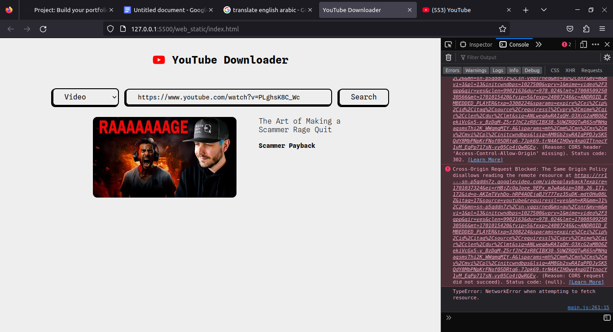

```

██╗░░░██╗░█████╗░██╗░░░██╗████████╗██╗░░░██╗██████╗░███████╗
╚██╗░██╔╝██╔══██╗██║░░░██║╚══██╔══╝██║░░░██║██╔══██╗██╔════╝
░╚████╔╝░██║░░██║██║░░░██║░░░██║░░░██║░░░██║██████╦╝█████╗░░
░░╚██╔╝░░██║░░██║██║░░░██║░░░██║░░░██║░░░██║██╔══██╗██╔══╝░░
░░░██║░░░╚█████╔╝╚██████╔╝░░░██║░░░╚██████╔╝██████╦╝███████╗
░░░╚═╝░░░░╚════╝░░╚═════╝░░░░╚═╝░░░░╚═════╝░╚═════╝░╚══════╝

██████╗░░█████╗░░██╗░░░░░░░██╗███╗░░██╗██╗░░░░░░█████╗░░█████╗░██████╗░███████╗██████╗░
██╔══██╗██╔══██╗░██║░░██╗░░██║████╗░██║██║░░░░░██╔══██╗██╔══██╗██╔══██╗██╔════╝██╔══██╗
██║░░██║██║░░██║░╚██╗████╗██╔╝██╔██╗██║██║░░░░░██║░░██║███████║██║░░██║█████╗░░██████╔╝
██║░░██║██║░░██║░░████╔═████║░██║╚████║██║░░░░░██║░░██║██╔══██║██║░░██║██╔══╝░░██╔══██╗
██████╔╝╚█████╔╝░░╚██╔╝░╚██╔╝░██║░╚███║███████╗╚█████╔╝██║░░██║██████╔╝███████╗██║░░██║
╚═════╝░░╚════╝░░░░╚═╝░░░╚═╝░░╚═╝░░╚══╝╚══════╝░╚════╝░╚═╝░░╚═╝╚═════╝░╚══════╝╚═╝░░╚═╝
```

<br><br><br>

# Table of content

- [About project](#section-0)
- [How does it work](#section-1)
- [Infrastructure](#section-2)
- [Technologies](#section-3)
- [Screenshots](#section-4)
- [Issues](#section-5)
- [Authors](#section-6)

<br><br><br>

# About <a id="section-0"></a>

<h4 align="center">
    Hi 👋, This project created for ALX research which is a website that provide the service of downloading videos from YouTube. But unfortunately it does not work, because of some issues I did not find a solution to solve, which prevent me from completing my work.
</h4>

<br><br>

# How does it work <a id="section-1"></a>

<h4>
    This website is created to download videos and playlists from youtube, it depends on the YouTube API and Python Third-Party (PyTube).
</h4>

- <b>Front-End:</b> I used HTML, CSS and JavaScript to create the User Interface (UI). This part uses the YouTube api to fetch videos or playlists data and displays its content like (Thumbnails, Video title, Channel name...).

- <b>Back-End:</b> I used Python to create the program that returns a response to the browser in JSON, which is the video links in different qualities.

<br><br>

# Infrastucture <a id="section-2"></a>

<br>


<br><br>

# Technologies <a id="section-3"></a>

- <b>HTML, CSS:</b> Used to create web page with beautiful design.
- <b>Fontawesome:</b> It gives dynamic icons for free, it is really awesome.
- <b>JavaScript:</b> It is used to create the functionality to my website and for fetching data from YouTube API and Server.
- <b>Python:</b> On the server-side I used Python to create my program that generates download links for videos.
- <b>Flask:</b> Framework that helps me to create the function routes that returns data to the front-end.

<br><br>

# Screenshots <a id="section-4"></a>

<b> This is screenshots of our project </b>

### Video

<br>


<br>

### Playlist

<br>


<br><br>

# Issues <a id="section-5"></a>

<h4>
    Unfortunately, In the end the website did not work because I have faced an issue that prevented me from completing my work. It is related to the download links that come from the Server-Side. It did not work, because the browser denies download from those direct links.
</h4>

### The error

<br>



<br><br>

# Authors <a id="section-6"></a>

- [Abdelemjid Essaid](https://github.com/abdelemjidessaid) I have created this project alone.
